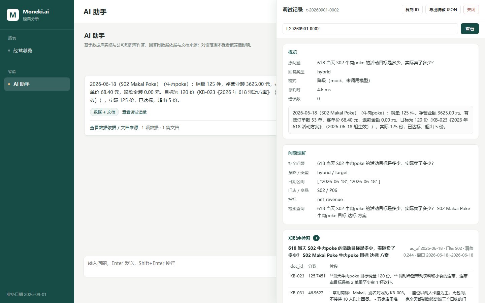

# DEMO.md

一条**混合问题**从提问 → 数据库查询 → 文档引用 → 界面证据的真实演示。全部为无 Key 的 mock 降级模式实测。

## 0. 启动（3 步，见 README）

```bash
cd starter && python -m venv .venv && .venv/Scripts/pip install -r requirements.txt
.venv/Scripts/python -m kbqa.rebuild
.venv/Scripts/python -m uvicorn kbqa.server:app --port 8000        # 后端
cd ../frontend && npm ci && npm run dev                             # 前端 http://localhost:5173
```

## 1. 提问

浏览器打开 http://localhost:5173 → 侧栏点「**AI 助手**」→ 输入：

> 618 当天 S02 牛肉poke 的活动目标是多少，实际卖了多少？

这一句同时要**数据库实绩**（当天实际销量）和**文档目标值**（活动方案里的目标），是典型的混合题。

## 2. 服务端发生什么（`POST /api/chat`）

1. `Planner` 解析出：时间窗 `2026-06-18 ~ 2026-06-18`、门店 `S02`、商品 `P06`、指标含销量，intent=`hybrid`；
2. `Answerer` 先按口径查库（`query_metrics`，KB-001 v3 口径：净营业额含退款、有效订单数按不同 `order_id`、销量扣除退款）；
3. 再检索知识库拿目标值（`retriever.search`，与 `/api/retrieve` 同一套），从命中的文档里逐字挑出支撑目标的短句；
4. 组装成 `hybrid` 回答，**数字来自真实查询、目标来自真实文档**。

接口返回（节选）：

```json
{
  "answer": "2026-06-18（S02 Makai Poke）（牛肉poke）：销量 125 件，净营业额 3625.00 元，……目标为 120 份（KB-023《2026 年 618 活动方案》（2026-06-18 起生效）），实际 125 份，已达标，超出 5 份。",
  "answer_type": "hybrid",
  "citations": [
    { "doc_id": "KB-023", "quote": "**当天牛肉poke 目标销量 120 份。" }
  ],
  "data_evidence": [
    {
      "tool": "query_metrics",
      "params": { "start": "2026-06-18", "end": "2026-06-18", "store_id": "S02", "product_id": "P06" },
      "result": { "net_revenue": 3625.0, "orders": 53, "aov": 68.4, "qty": 125, "...": "..." }
    }
  ],
  "trace_id": "t-20260901-0004"
}
```

- `answer_type: "hybrid"` = 数据 + 文档两种来源都用了；
- `citations[0].quote` 是 KB-023 可见正文里的**连续原文**（逐字可核对）；
- `data_evidence[0]` 是**真实执行过**的 `query_metrics` 调用与结果。

## 3. 界面上看到什么

`docs/screenshots/assistant-hybrid.png`（实拍）：

- 回答下方的「**数据 + 文档**」徽标标明来源类型；
- 点「**查看数据依据 / 文档来源**」展开：**1 项数据 · 1 篇文档**；
- **文档卡**显示 `KB-023` 与真实 `quote`；
- **数据卡**显示工具名 `query_metrics`、范围 `2026-06-18 ~ 2026-06-18 · 门店 S02 · 商品 P06`，以及结果 JSON（过长会标注截断）。

右上角徽标显示「**本地演示 · 降级模式（未配置模型 Key）**」——这是 mock 模式的真实状态；配置 Key 后会显示「已接入大模型 · 在线」。

## 4. 这条演示验证了什么

| 点 | 体现 |
|---|---|
| 混合问答 | 目标值来自文档、实绩来自数据库，两类证据同屏可查 |
| 引用真实 | `quote` 是文档原文的连续片段，逐字可核对 |
| 数字可溯 | 每个经营数字都对应真实执行过的工具调用 |
| trace 可查 | `GET /api/trace/t-20260901-0004` 能看到规划、检索命中与过滤、工具结果、完整模型请求/响应（live 时） |
| 降级真实 | 无 Key 时如实标注「本地演示 · 降级模式」，不伪造「已接入大模型」 |

换个说法（如「618 牛肉poke 卖得怎么样，达标没」）同样能命中；换成知识库没有的话题（如「明天天气」）会得到如实拒答而不是编造。

## 5. 1–3 分钟现场演示：打开对应 trace

接着上面的问题，点回答下方的「**查看调试记录**」（或顶栏「调试记录」粘贴 `trace_id`），右侧抽屉按排查顺序展开：

1. **概览**：`trace_id`、原问题、回答类型 `hybrid`、模式「降级（mock，未调用模型）」、总耗时、错误数 0；
2. **问题理解**：补全问题、意图 `hybrid/target`、日期区间 `2026-06-18 ~ 2026-06-18`、门店 `S02`、商品 `P06`、检索查询；
3. **知识库检索**：`KB-023` 分数 125.7451 排第一，片段预览就是「当天牛肉poke 目标销量 120 份」，另有被过滤片段的原因；
4. **工具与数据**：`query_metrics`，参数 `start=2026-06-18 end=2026-06-18 store_id=S02 product_id=P06`，
   结果 `qty=125 / net_revenue=3625.0 / orders=53`，耗时、结果字节数、`已用于证据`；
5. **模型与异常**：mock 模式显示「本次未调用模型」（配 Key 后这里会显示逐轮请求与原始响应）；
6. **时间线**：`plan → tool → search → answer_mock → response` 及各步耗时。

**要点**：检索到的片段（第 3 段）与最终引用的（回答里的 `citations` / 第 4 段的 `entered`）是两件事，
面板分开显示；数据证据来自真实执行的 `query_metrics`，可以看到参数与结果对得上。



