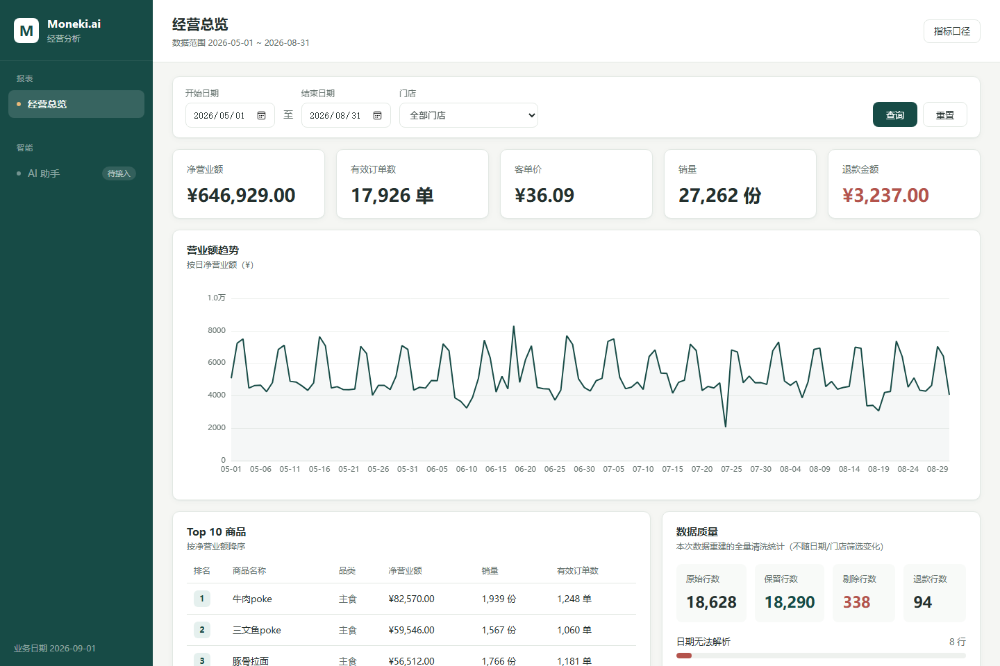

# Moneki.ai 经营分析系统

连锁餐饮品牌 Moneki.ai 的内部经营分析系统：经营看板 + AI 混合问答助手。
已完成三关：**经营看板**（筛选/趋势/Top10/数据质量）、**RAG 修复**（检索/版本/引用）、
**混合问答**（数据 + 文档双证据，mock 降级与 live 模型编排）。

- 业务口径以知识库 **KB-001《指标口径手册 v3》** 为准（现行版，2026-05-01 起生效）。
- 系统的"今天"固定为 **2026-09-01**，与真实电脑日期无关。
- 作业原文（任务说明）保留在 `docs/ASSIGNMENT.md`，接口契约见 `docs/API_CONTRACT.md`。
- 模型接入说明见 **`LLM_SETUP.md`**，混合问答的真实演示流程见 **`DEMO.md`**，
  现场调试流程见 **`DEBUGGING.md`**（从一个 trace_id 走到根因与修复）。

## 快速开始（3 步）

需要 Python 3.12+ 和 Node.js 18+。

> **可选：接入真实模型。** 复制 `.env.example` 为 `.env`，填上 `LLM_BASE_URL` / `LLM_API_KEY` / `LLM_MODEL`，
> 启动时自动读入（`.env` 已在 `.gitignore` 里，Key 不会入库）。**不配也能跑**——服务进入 mock 降级模式，
> 看板、检索、问答都照常工作。`/api/health` 的 `llm_mode` 会如实显示当前是 `live` 还是 `mock`。

**第 1 步：装依赖**

```bash
cd starter
make setup                # 建虚拟环境并安装依赖
```

**第 2 步：重建清洗表与检索索引**

```bash
make rebuild              # 从 ../data 与 ../knowledge_base 重建
```

**第 3 步：启动后端与前端**

```bash
make run                  # 后端：http://localhost:8000（API 文档 /docs）
make run-mock             # 同上，但强制本地降级模式：不读 .env，也不认系统里的三件套
make env-mode             # 只打印当前配置会走 live 还是 mock（排查"配了 Key 为什么还是 mock"）
```

另开一个终端：

```bash
cd frontend
npm install
npm run dev               # 前端：http://localhost:5173，/api 自动代理到 8000
```

浏览器打开 **http://localhost:5173** 即可看到经营总览；侧栏「**AI 助手**」进入混合问答工作区。

> Windows 下如果没装 make，等价命令：`python -m venv .venv` →
> `.venv\Scripts\pip install -r requirements.txt` →
> `.venv\Scripts\python -m kbqa.rebuild` →
> `.venv\Scripts\python -m uvicorn kbqa.server:app --port 8000`。
> 想直接用上面的 `make` 命令，装一个 GNU Make 即可（Linux/macOS 一般自带；CI 也用 make）；
> 装了便携版可以用 `MAKE_BIN=/path/to/make` 指定给测试。
>
> 后端不在 8000 端口时，用 `VITE_API_TARGET=http://127.0.0.1:8001 npm run dev`
> 指定代理目标。

## 跑测试

```bash
cd starter
make test                 # 后端测试（187 个）：清洗口径、日期边界、清洗规则、分词/切块/安全、
                          # 只读 SQL 闸门、SQLite 内部对象、业务表白名单、有界读取、证据体积、
                          # live 数字取证、search_kb 继承 Plan、trace 记录与持久化、
                          # loader doc_id、.env 读取、新增文档/换数据演练等
```

> `run_sql` 只接受单条只读查询（`SELECT`/`WITH … FROM`），拒绝 `sqlite_master`/`sqlite_schema`/
> `pragma_*` 等内部对象、`file:` 路径与扩展加载，且只能访问业务表 `sales_clean`/`stores`/`products`；
> DataTools 的连接本身也是只读的（URI `mode=ro` + `PRAGMA query_only`）。
> 见 `DEBUG_LOG.md` D12、D19 与分层 5/6。

## 跑公开评测

```bash
# 服务起在 8000（默认）后，在仓库根目录执行（只依赖 Python 标准库）：
python3 eval/run_eval.py --base-url http://localhost:8000 --questions eval/public_questions.jsonl

# 只跑某一类，调试更快：
python3 eval/run_eval.py --base-url http://localhost:8000 --questions eval/public_questions.jsonl --only retrieval
```

公开题库（无 Key 的 mock 降级模式）实测满分 100/100，分数与运行命令见 `EVAL_REPORT.md`；逐缺陷根因见 `DEBUG_LOG.md`。

> ⚠️ **配了 `.env` 之后服务默认是 live 模式**，这时跑出来的是真实模型成绩，不是 mock 基线。
> 要复现 mock 基线（评测、门禁、演练都以此为准），把 `.env` 关掉再起服务：
>
> ```bash
> ENV_FILE= python -m uvicorn kbqa.server:app --port 8000     # ENV_FILE= 表示一个字都不读 .env
> ```

## 回归门禁

`eval/run_eval.py` 失分也返回退出码 0，不能直接当门禁；用 `eval/check_regression.py` 对比仓库里跟踪的 mock 基线：

```bash
python eval/run_eval.py --base-url http://localhost:8000 --questions eval/public_questions.jsonl
python eval/check_regression.py --report report.json      # 退步/漏题/坏报告 → 非零退出

# 调试时只跑了部分类别（--only doc）：那是"快速定位"，不是判定。
# 局部报告不能直接跟全量基线比（总分/分类分不可比，会刷出"缺题"假回归），要加 --subset：
python eval/check_regression.py --report report.json --subset
```

`--subset` 只比新报告里出现过的题目，并明确打印"总分与分类分未比较"；基线里没有的题号直接报错。
不加参数就是全量严格比较。**定稿/提交前必须跑完整题库的那一次。**

输出版式：`[逐题] C01（doc）失败检查 citations；trace_id=t-20260901-0007`。
`.github/workflows/ci.yml` 已经串起来：后端 pytest → rebuild → 起服务等健康检查 → 公开题库评测 →
回归判定 → 前端 `npm ci` + `npm run build`；**不需要任何真实 Key**，也不请求付费模型。
基线 `eval/baseline_mock.json`（题库 `eval/public_questions.jsonl`、`llm_mode=mock`、55 题满分）。

另外有两套自拟题与演练：

```bash
python eval/run_eval.py --base-url http://localhost:8000 --questions eval/extra_questions.jsonl  # 13 题，25/25
cd starter && .venv/Scripts/python ../eval/drill_new_doc.py                                      # 新增文档演练，11/11
```

## 可调试性

- 每次回答都有 `trace_id`；`GET /api/trace/{trace_id}` 给出规划、检索命中与过滤、**真实工具调用与结果**、
  完整模型请求/响应、耗时与错误。
- 前端「AI 助手」页可按 trace_id 打开**调试面板**，按排查顺序展示上面这些信息；见 `DEBUGGING.md`。
- trace 有界（最近 200 条）、脱敏（落盘前擦掉 Key）、持久化在 `starter/var/traces/`（已 gitignore），
  跨重启编号不重复、旧 ID 仍 404。

## 模型接入（live / mock）

- **配置来源**：只认 `LLM_BASE_URL` / `LLM_API_KEY` / `LLM_MODEL` 三个环境变量；本地想在 `.env` 里写一份，
  启动时会自动补进环境变量（`starter/kbqa/config.py` 的 `load_env_files`）。两条约定：
  - **真实环境变量优先**：`.env` 只补环境里还没有的键，所以评测/预检脚本注入的 `LLM_*` 不会被本地 `.env` 带偏；
  - **可以整体关掉**：`ENV_FILE=`（空串，或 `off`/`none`/`0`）表示一个字都不读，测试、CI、mock 演练都靠它。
- **mock**：不配 Key 时，`/api/chat` 走本地规划 + 检索 + 工具取数 + 模板渲染，公开题库满分，前端显示「本地演示 · 降级模式」。
- **live**：配好三件套后，`/api/chat` 走模型编排（模型出候选 → 代码核验数字/引用/范围 → 可信才返回），前端显示「已接入大模型 · 在线」。
- 切换只改环境变量、不改代码；接入预检（16 场景 P1–P14）13 项通过、1 项未检查，详见 **`LLM_SETUP.md` 第 7 节**。
- 混合问答的真实演示（提问 → 查询 → 文档引用 → 界面证据）见 **`DEMO.md`**。

## 架构

```
┌────────────┐   /api/*（Vite 代理）   ┌──────────────────────────┐
│  前端看板   │ ───────────────────────▶ │  FastAPI（starter/kbqa）  │
│ Vue3+TS    │                          │  server.py  参数校验/路由  │
│ Vite+ECharts│ ◀─────────────────────── │  service.py 组装/编排      │
│  + AI 助手  │       JSON               │  planner.py 规划/追问     │
└────────────┘                          │  answerer/hybrid 取证作答 │
                                        │  live.py   模型编排/核验  │
                                        │  tools.py   指标查询       │
                                        │  sqlguard.py 只读 SQL 闸门 │
                                        │  cleaning.py 清洗（KB-001）│
                                        │  retriever.py 检索/版本   │
                                        └───────────┬──────────────┘
                                                    │ 只读（mode=ro）
                              ┌─────────────────────┴─────────────────┐
                              │ var/clean.db（清洗后）   .cache/index.json│
                              ▲                                       ▲
                        data/pos.db                        knowledge_base/
                     （原始 POS 导出）                        （35 篇文档）
```

- 前端不直接读 CSV/SQLite，所有数字都来自接口的真实查询；不用 v-html 渲染模型文本。
- 数据库连接只读（`mode=ro` + `query_only`）；模型可调用的 `run_sql` 再过一层只读语法闸门
  （单条 SELECT、业务表白名单、内部对象与文件路径拦截），写入与 `ATTACH` 均被拒绝。
- live 模式下模型只是「出候选」：回答里的经营数字必须对应真实工具调用、文档事实必须对应
  本轮检索到的片段原文，核验不过就用本地 Answerer 兜底并在 trace 标明原因。
- 换数据或知识库后执行 `make rebuild`，页面与问答展示的就是新结果；代码里没有写死任何数字。



## 技术选型

- **后端保留 starter 的 FastAPI**：契约接口都在这条服务上，评测脚本也按它来。
- **前端 Vue 3 + TypeScript + Vite + ECharts**：单页看板规模小，不需要后台模板；
  ECharts 用按需引入（LineChart + Grid + Tooltip），打包 gzip 约 190 KB。
- **清洗/指标纯 Python + SQLite**：数据量 1.8 万行，不需要额外引擎；金额以分（cents）
  为整数单位避免浮点误差，客单价四舍五入用 `ROUND_HALF_UP`。

## 口径与歧义的取舍

全部按 KB-001 v3（现行版）执行，不参考 v2 或交接文档：

| 点 | 取舍 | 依据 |
|---|---|---|
| 退款 | 计入净营业额（负数相减）；退款金额为绝对值单独展示 | v3 §4，v2 的"剔除退款行"已废止 |
| 有效订单数 | 销售行中不同 `order_id` 的个数，多行订单算 1 单 | v3 §4，v2 的"按明细行数"已废止 |
| 客单价 | 净营业额 ÷ 有效订单数，`ROUND_HALF_UP` 保留 2 位 | v3 §4 |
| 退款归属 | 按退款行自己的日期/门店/商品归属，不回溯原单 | v3 §4 / §7.4 |
| 金额为空 | 直接剔除，不按建档价回填 | v3 §3.2，v2 的回填已废止 |
| 日期格式 | `YYYY-MM-DD` / `YYYY/M/D` / `DD-MM-YYYY`（日在前）三种；`2026-13-45` 这类非真实日期判为无法解析 | v3 §2.2 |
| 重复行 | 七个字段规范化后完全一致才判重；共用订单号的不同商品行全部保留 | v3 §3.6 / §7.3 |
| 建档价 | 只做展示参考，金额一律以 `amount` 实收为准 | v3 §5.3 |
| 环比 | 未展示——没有做同口径的真实对比区间之前，不生成百分比 | 第一关要求 |

## 已知边界

- 数据质量区展示的是**本次重建的全量清洗统计**，不随日期/门店筛选变化（页面上有注明）。
- 筛选区间开始日期晚于结束日期时，前端禁用查询按钮并提示；接口本身对这类区间返回空数据。
- 真实 live（对 DeepSeek 真实接口跑公开评测）**未验证**——本机没有 Key；
  模型接线已用预检（fake 模型）与单元桩件验证到 P1–P13 全过，见 `LLM_SETUP.md`。
- live 模式的回答核验失败时会回退到本地 Answerer 的模板回答（trace 里标明原因），
  因此 live 的回答质量受检索质量影响；检索为纯 BM25 + 别名扩写，无向量检索。
